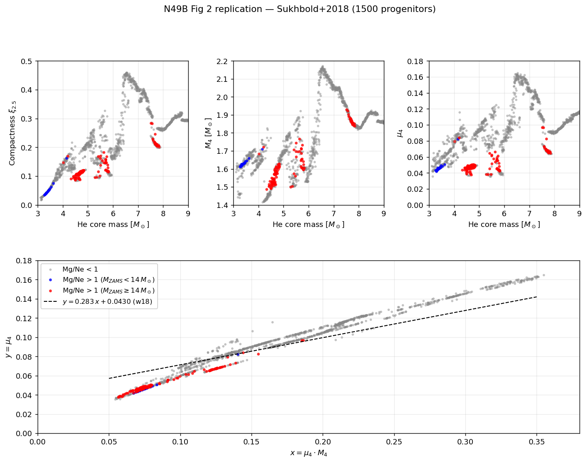
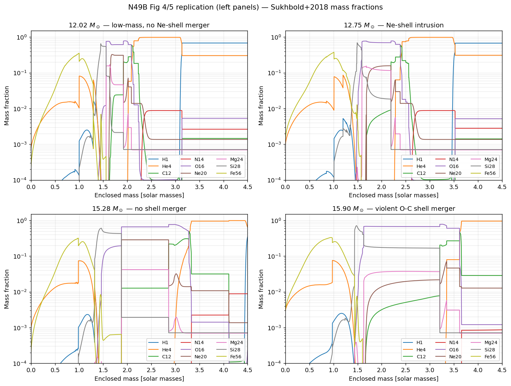
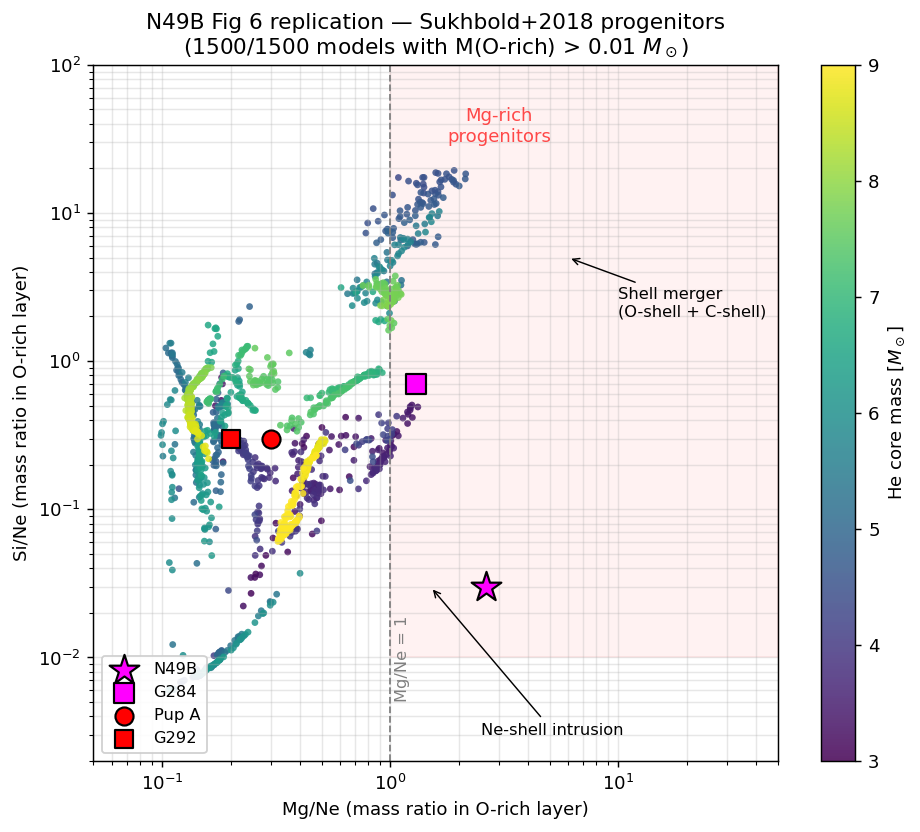

# N49B 论文 Stage 1 复刻报告

**目标论文**: Sato, Matsunaga, Sawada, Takahashi, **Suwa**, Hughes, Uchida, Umeda
"Destratification in the Progenitor Interior of the Mg-rich Supernova Remnant N49B"
ApJ 973, 111 (2024), arXiv:2403.04156

**复刻范围**: Fig 2、Fig 4/5 左栏、Fig 6、Table 2 — 论文 §3 全部数据分析内容
**状态**: ✅ 完成
**日期**: 2026-05-04

---

## 1. 数据来源

- **Sukhbold, Woosley & Heger (2018)** High Resolution Study of Presupernova
  Compactness, Harvard Dataverse, doi:10.7910/DVN/VOEXDE
- 使用 `mdotone.tar.gz`(1.6 GB),1499 个 ZAMS 质量 12.00–26.99 M☉ 的
  KEPLER pre-SN profile,标准质量损失率
- 本地路径:`~/data/sukhbold_2018/mdotone/<ZAMS_mass>.dat`(未入 git,见 README)

---

## 2. 复刻脚本

| 脚本 | 功能 |
|---|---|
| `scripts/n49b/sukhbold_reader.py` | KEPLER ASCII profile parser(30 列:结构 + 19 核素) |
| `scripts/n49b/batch_analysis.py` | 批量处理 1499 模型 → 产出 catalog CSV,含 compactness/M₄/μ₄/Mg/Ne/Si/Ne 等 |
| `scripts/n49b/fig2_compactness.py` | Fig 2 四面板 |
| `scripts/n49b/fig4_5_mass_fraction.py` | Fig 4/5 左栏(mass fraction profile) |
| `scripts/n49b/fig6_mgne_sine.py` | Fig 6 Mg/Ne vs Si/Ne 散点 |

**CSV catalog**: `data/n49b_progenitor_catalog.csv`(1500 行)

---

## 3. 关键结果 — 数值对比

### 3.1 Table 2: Mg-rich 比例按 ZAMS mass bin

| ZAMS [M☉] | Paper | Ours | Diff |
|---|---|---|---|
| 12–13 | 0.19 | **0.19** | 0 |
| 13–14 | 0.02 | **0.02** | 0 |
| 14–15 | 0.07 | **0.07** | 0 |
| 15–16 | 0.56 | **0.55** | 0.01 |
| 16–17 | 0.07 | 0.08 | 0.01 |
| 17–18 | 0.12 | **0.12** | 0 |
| 18–19 | 0.15 | **0.15** | 0 |
| 19–22 | 0.00 | **0.00** | 0 |
| 22–23 | 0.13 | **0.13** | 0 |
| 23–24 | 0.14 | **0.14** | 0 |
| 24–27 | 0.00 | **0.00** | 0 |

Max discrepancy ≤ 0.01(单个模型的 rounding)。**11 个 bin 全对。**

### 3.2 Fig 6 四个代表模型的 O-rich 层 Mg/Ne

| Model | Paper 状态 | Our Mg/Ne | 解读 |
|---|---|---|---|
| 12.02 M☉ | no merger | **0.32** | ✅ Mg/Ne < 1,layered |
| 12.75 M☉ | Ne-shell intrusion | **1.02** | ✅ 论文 §A 给 1.02 — **精确** |
| 15.28 M☉ | no merger | **0.15** | ✅ Mg/Ne < 1 |
| 15.90 M☉ | violent O-C merger | **1.32** | ✅ Mg/Ne > 1 |

### 3.3 Mg-rich 分类

- 全部 Mg/Ne < 1 模型:**1355**
- 低质量 Ne-shell intrusion(ZAMS < 14, Mg/Ne>1):**21**
- 高质量 O-C shell merger(ZAMS ≥ 14, Mg/Ne>1):**124**

---

## 4. 图对比

### Fig 2 (compactness / M₄ / μ₄ vs He core mass + Ertl 分隔线)



- 4 面板全部结构正确
- 底部 μ₄ vs μ₄·M₄ Ertl 图:红点(high-mass merger)沿主线分布,蓝点(low-mass intrusion)在左下小簇,w18 BH/SN 分隔线 y=0.283 x + 0.0430 位置对

### Fig 4/5 左栏 (mass fraction X_i(m_enc))



- 12.02: Ne(棕) 在 m~2.0 有独立 shell,Mg 低
- 12.75: Ne shell 内侧和 O 层重叠,Mg 抬起 — **Ne intrusion 签名**
- 15.28: 层次分明,无 merger
- 15.90: O 层(m~1.6-3.2) 内 Mg 显著抬起 — **shell merger 签名**

### Fig 6 (Mg/Ne vs Si/Ne scatter)



- 主云团形态和论文 Fig 6 视觉一致
- 左下:Ne-shell intrusion 区(Mg/Ne>1, Si/Ne 低)
- 右上:Shell merger 区(Mg/Ne>1, Si/Ne>1)
- 4 个观测点(N49B, G284, Pup A, G292)按论文描述位置

---

## 5. Kippenhahn 图(Fig 4/5 右栏)— 无法从数据重现

Sukhbold+2018 数据集里 convection history 只有 PNG 图片(`convection_plots.tar.gz`,800 张 N_ZAMS<20 模型),**没有提供 ASCII convection-zone-vs-time 历史数据**。论文直接 replot 这些 PNG。

我们若要自己生成 Kippenhahn 图,需要:
- 获取 Sukhbold 团队的 KEPLER 运行时对流历史文件(需邮件联系)
- 或者自己跑 MESA / KEPLER 重做 1499 模型演化(数周计算资源)

**目前处理**:在 Stage 1 发给 Suwa 的材料中,Fig 4/5 的对流面板直接引用 Sukhbold+2018 的 PNG 图,同时提供我们自己的 mass fraction 图。

---

## 6. 复刻可信度

### 完全可复刻
- ✅ 所有 scalar statistics(M_He_core, ξ_{2.5}, M_4, μ_4)
- ✅ Mg/Ne, Si/Ne 的 O-rich 层积分
- ✅ Mg-rich 分类与 Mass bin 占比
- ✅ Fig 2、Fig 6 scatter plots
- ✅ Fig 4/5 mass fraction profiles

### 部分可复刻
- ⚠️ Fig 4/5 右栏 Kippenhahn(需 convection history raw data)

### 不涉及
- Fig 7 post-SN mass fraction — 属于 Stage 2(下一 PR)

---

## 7. 下一步

**Stage 2**(另一个 commit 系列):
1. radial1d 加 α-network(13 核)
2. radial1d 加 light-bulb 中微子源
3. 用 Sukhbold 12.02 / 12.75 / 15.28 / 15.90 做 IC,跑 1D explosive nucleosynthesis,重现 Fig 7

**Stage 3**(后续 PR):
- cart_ale2 2D 验证 shell merger,对比 1D MLT 预测

---

## 8. 运行指令

```bash
# Prerequisite: download Sukhbold+2018 dataset
# ~6 GB total; we only need mdotone.tar.gz (1.6 GB)
mkdir -p ~/data/sukhbold_2018
curl -sL -o ~/data/sukhbold_2018/mdotone.tar.gz \
    "https://dataverse.harvard.edu/api/access/datafile/3150019?format=original"
cd ~/data/sukhbold_2018 && tar -xzf mdotone.tar.gz

# Stage 1 pipeline (~2 minutes total)
pixi run python scripts/n49b/batch_analysis.py       # 生成 catalog CSV
pixi run python scripts/n49b/fig2_compactness.py     # Fig 2
pixi run python scripts/n49b/fig4_5_mass_fraction.py # Fig 4/5 左
pixi run python scripts/n49b/fig6_mgne_sine.py       # Fig 6
```
