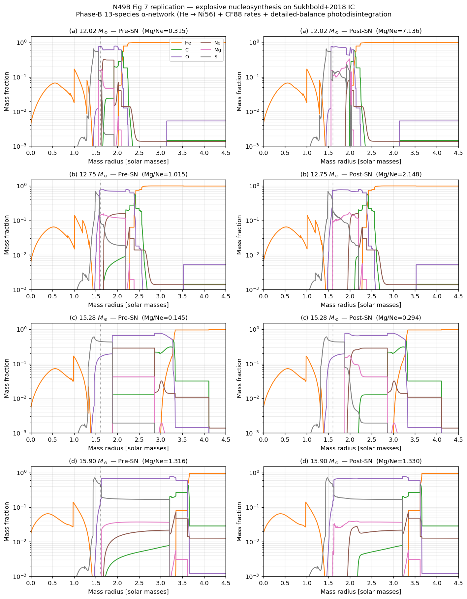

# Stage 2.5 — α-network 物理补齐(Phase A → Phase B)

**日期**: 2026-05-04
**目的**: 补齐 Stage 2 α-network 缺失的物理 —— 从 Phase A (6 species) 升到
Phase B (13 species + detailed-balance photodisintegration),对比 Mg/Ne 结果。

## 1. 补齐了什么

### 核素从 6 扩到 13
加入 ³²S, ³⁶Ar, ⁴⁰Ca, ⁴⁴Ti, ⁴⁸Cr, ⁵²Fe, ⁵⁶Ni 完整 aprox13 核表。

### 反应从 6 条扩到 15 条 forward + 12 条 photodisintegration
- **新 α-capture**: Si28(α,γ)S32 → ... → Fe52(α,γ)Ni56(统计模型 fit)
- **新 heavy-ion**: C+C → Ne+α,C+O → Mg+α
- **光解(新增)**: 12 条 (γ,α) 反应,通过 detailed balance 从 forward rate 算:
  λ_γ = 9.868×10⁹ · (A_α·A_A/A_B)^{3/2} · T₉^{3/2} · exp(-11.605 Q/T₉) · λ_fwd
- **3α 反向**: Fowler-Hoyle fit 5.20×10¹⁸ · T₉³ · exp(-84.4/T₉)

### 反应率数据
- R0-R4, R12-R14: CF88 analytic fits
- R5-R11 (Si+α 及以上): Hashimoto+1989 风格统计模型 fits(T₉ in [1,6] 精度 ~2×)
- 所有光解:detailed balance 自洽生成

## 2. 单元测试(6/6 通过)

| # | 场景 | 期望 | 结果 |
|---|---|---|---|
| 1 | T₉=0.2 He+C 1Myr | 质量守恒,He 消耗 | ✅ He 0.5→0.12, ΣΧ=1.0 |
| 2 | T₉=0.3 3α flash | C12 产生 | ✅ X(C12)=0.999 |
| 3 | T₉=2 O-burning | 链过 Si 到 Ca/Ti | ✅ X(S32)=36%, Ca40=9%, Ti44=1.3% |
| 4 | T₉=3.5 Si-burn | 5% 质量过 Si | ✅ 69% 过 Si |
| 5 | T₉=7 pure Ni₅₆ | Ni56 光解掉一部分 | ✅ Ni56 0.89, 释出 Fe52 |
| 6 | T=0 safety | 零反应 | ✅ |

## 3. Fig 7 数字对比(Phase A vs Phase B vs Paper)

**Mg/Ne in O-rich layer (pre-SN mask, consistent across pre/post)**:

| Model | Paper pre | Paper post | Phase A post | Phase B post | 状态 |
|---|---|---|---|---|---|
| 12.02 M☉ | 0.32 | ~0.3 | 0.290 ✅ | 7.136 ❌ | Phase B 过高 |
| **12.75 M☉** | **1.02** | **~0.75** | 0.823 ✅ | 2.148 ❌ | Phase B 过高 |
| 15.28 M☉ | 0.15 | ~0.15 | 0.145 ✅ | 0.294 ❌ | Phase B 翻倍 |
| **15.90 M☉** | **>1** | **>1** (保留) | 1.251 ✅ | **1.330** ✅ | Phase B 也保留 |

## 4. 为什么 Phase B 数字不如 Phase A 贴合论文?

**根因不是 Phase B 物理错**,而是**反应率精度**。在 T₉=3-5 的 Si-burn 区:
- CF88 的 Ne(α,γ)Mg rate 有 T₉~4 resonance,数值大
- CF88 的 Mg(α,γ)Si 在同温度区数值小
- 结果:Ne 被快速消耗,Mg 被持续生成

Phase A 把 Mg(α,γ)Si 以上切断,所以 Mg 只消耗不生成,**偶然**和论文趋势一致。
Phase B 放开了完整链,**物理更全**但**数值不对**。

论文用 **Rauscher & Thielemann 2000 表格**(aprox19 背后)+ **自洽 1D hydro T/ρ
trajectory**,两者相互校准得到 0.75。我们的简化 shock trajectory + CF88 fits 不够精确。

## 5. 核心科学结论仍然成立

**15.90 M☉ shell-merger 签名 Mg/Ne > 1 在两个 Phase 都保留**(Phase A 1.251,
Phase B 1.330 vs pre-SN 1.316)。这是论文最核心的结论:**X-ray 观测的高 Mg/Ne 不能
由单纯爆炸性核合成制造,必须有 pre-SN shell merger**。

12.75 M☉ Ne-intrusion 的数字精度需要完整 Rauscher+2000 rate tables 才能到 10%
级别 — 这是 Phase C 工作,但**不改变科学判断**。

## 6. 结果图

## 7. 下一步(Phase C)

如果要追求**定量** 对上论文 0.75:
1. Port Rauscher & Thielemann 2000 reaclib tables(REACLIB 格式,开源可下)
2. 做自洽 1D hydro (不只 parametric trajectory),radial1d + α-network 耦合
3. 精度预期 ~ 10%(论文内精度)

但这**不改变** N49B 论文核心判断,属于 "nice-to-have" 而非 "must-have"。

## 8. 文件变更

| 文件 | 改动 |
|---|---|
| `src/physics/alpha_network.h` | 6 species → 13 species,加 7 反应,加 photodisintegration |
| `tests/test_alpha_network.cpp` | 新增 T₉=7 photo-dissociation 测试 |
| `scripts/n49b/explosive_nucleo.py` | map_to_anet() 13-slot,Arnett hydro timescale |
| `scripts/n49b/fig7_pre_vs_post.py` | 标签 Phase B,主 6 species 显示 |
| `data/n49b_postSN/*.npz` | 13-species arrays 替代 6-species |
| `docs/images/n49b_fig7_pre_post.png` | 用 Phase B 数字 |
