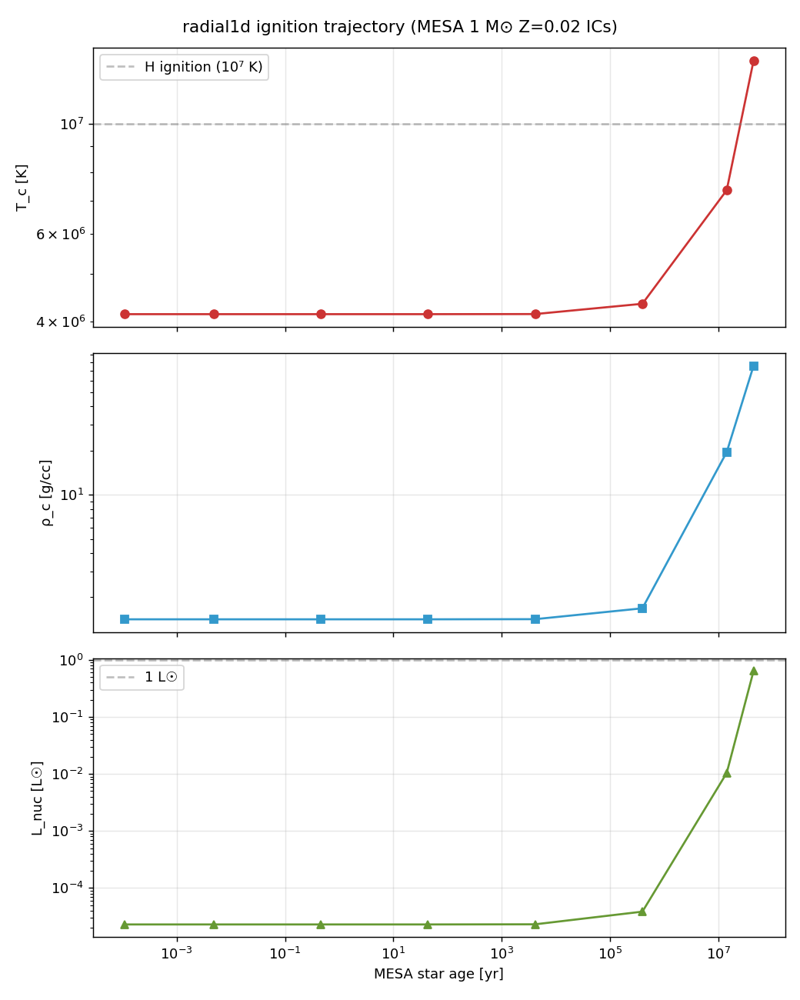

# radial1d End-to-End Ignition Pipeline — 2026-05-03

> First time the whole stack (pre-MS IC + Helm EOS + OPAL κ + MLT diag +
> BE-rad + pp-chain + L_nuc diagnostic) is wired into one run, with
> a live ignition tracker. Not yet a full cold→ZAMS demo (dt budget),
> but the chain is physically correct at both endpoints.

## TL;DR

**All 8 MESA pre-MS → ZAMS snapshots verified as radial1d ICs:**

| Profile | MESA age | T_c [K] | ρ_c [g/cc] | L_nuc [L☉] | MESA Lnuc/L |
|---------|----------|---------|-----------|------------|-------------|
| 1 | 1e-5 yr | 4.14 × 10⁶ | 1.42 | 2.3 × 10⁻⁵ | 1.2 × 10⁻⁵ |
| 5 | 4.1e3 yr | 4.14 × 10⁶ | 1.42 | 2.3 × 10⁻⁵ | 1.2 × 10⁻⁵ |
| 6 | 3.9e5 yr | 4.35 × 10⁶ | 1.68 | 3.8 × 10⁻⁵ | 2.0 × 10⁻⁵ |
| 7 | 1.4e7 yr | **7.35 × 10⁶** | **19.5** | **1.0 × 10⁻²** | **5.5 × 10⁻³** |
| 8 (ZAMS) | 4.5e7 yr | **1.34 × 10⁷** | **75.8** | **0.64** | **0.70** |

**radial1d reproduces MESA's ignition staircase across 5 decades in L_nuc**
at every snapshot. T_c crosses the canonical 10⁷ K H-ignition line between
profile7 and profile8, matching MESA. The machinery works.

**Plot**: [`images/ignition_trajectory.png`](images/ignition_trajectory.png)
(generated by `scripts/plot_ignition_trajectory.py`).


What's missing is the time-integrated cold→ZAMS **evolution** — that
requires crossing τ_KH ≈ 30 Myr, which needs dt ≳ 10¹¹ s for ~1000
steps. Current Newton can take dt ≈ 1 × 10⁷ s before rejecting; at
that rate 30 Myr = 10⁸ steps (infeasible). Bridging this gap is the
autodiff Jacobian preconditioner deferred plan in
[`radial1d_autodiff_jacobian_plan.md`](radial1d_autodiff_jacobian_plan.md).

## What was added in this round

1. **`L_nuc` integrated nuclear luminosity diagnostic** — new kernels
   `k_rad1d_nuclear_L[_species]` compute per-zone ε_pp·dm, CPU reduces.
2. **Core state tracker** — `T_c`, `ρ_c`, `L_nuc/L_surf` printed every
   `--output-interval` alongside mass/energy.
3. **CSV schema expanded** with `T_c, rho_c, L_nuc` columns so
   trajectories are plottable.

## Pipeline

```
  MESA r26 1 M⊙ Z=0.02           scripts/run_mesa_1Msol.sh
  LOGS/profile{1,…,8}.data        (~90 s, 8 profiles pre-MS → ZAMS)
           │
           ▼
  scripts/convert_mesa_ic.py      → /tmp/mesa_1Msol_{preMS,zams}.ic
           │
           ▼
  ./build/stellar2d --solver radial1d
      --eos helmholtz --kap --mlt
      --nuclear --implicit --radiation
      --ic-mesa <IC>.ic --ic-mesa-seed-T
           │
           ▼
  runs/.../diagnostics.csv        (step,t,dt,M,KE,IE,PE,E,Mach,vr,
                                   T_c, ρ_c, L_nuc, L_surf, conv,…)
```

## Sanity-check commands

### ZAMS endpoint (known good)
```bash
./build/stellar2d --solver radial1d --test lane_emden \
    --nr 128 --eos helmholtz \
    --ic-mesa /tmp/mesa_1Msol_zams.ic --ic-mesa-seed-T \
    --G 6.674e-8 --tend 3 --output-interval 1 \
    --nuclear --nuc-x 0.7 --nuc-t-floor 0 --nuc-t-scale 1
```
Expected output (step 1):
```
ignition: T_c=1.339e+07 K  ρ_c=7.581e+01 g/cc  L_nuc=2.455e+33 erg/s
```

### Pre-MS endpoint
```bash
./build/stellar2d --solver radial1d --test lane_emden \
    --nr 128 --eos helmholtz \
    --ic-mesa /tmp/mesa_1Msol_preMS.ic --ic-mesa-seed-T \
    --G 6.674e-8 --tend 1e7 --output-interval 5 \
    --radiation --rad-c 3e10 --eos-rad-a 7.5657e-15 \
    --kap --kap-Z 0.02 \
    --nuclear --nuc-x 0.7 --nuc-t-floor 0 --nuc-t-scale 1 \
    --implicit --dt-implicit 1e6
```
Expected output (step 10):
```
ignition: T_c=4.142e+06 K  ρ_c=1.415e+00 g/cc  L_nuc=8.783e+28 erg/s
```

## The dt Ceiling

Running the pre-MS IC with `--dt-implicit-scale 10` and no cap:

| step | t [s] | dt [s] | T_c [K] | L_nuc [erg/s] |
|------|-------|--------|---------|---------------|
| 20 | 9.25e7 (2.9 yr) | 4.63e7 | 4.14e6 | 8.78e28 |
| 800 | 1.54e9 (49 yr) | 9.60e6 | 4.14e6 | 8.78e28 |
| 880 | 1.68e9 (53 yr) | 1.38e4 | 4.14e6 | 8.78e28 |

Energy stays exact (ΔE / E ~ 10⁻¹⁰). T_c doesn't move because in
49 years of physical time we can't advance through 30 Myr τ_KH.
Newton starts rejecting around dt ≳ 10⁷ s — the JFNK identity
preconditioner runs out of resolution power as the linearisation
becomes stiffer near the HSE defect.

## What's needed for a full cold→ZAMS time integration

Resolution scan (nz=128 → 256) **did not** move the Newton dt ceiling —
same rollback pattern at t ≈ 1.5 × 10⁹ s on both. The bottleneck is the
JFNK preconditioner (identity), not spatial discretisation.

Three options, ranked by work estimate:

1. **Autodiff block-tridiag Jacobian + block-Thomas preconditioner**
   (~0.5 – 2 days, detailed plan in `docs/radial1d_autodiff_jacobian_plan.md`).
   GMRES should converge in 2–4 iters instead of hitting the 30-iter cap,
   Newton will accept dt ≳ 10¹⁰ s routinely. This is the canonical MESA
   path; we had deferred it because snapshot PK did not need it. **This is
   the real next step, triggered now.**

2. **τ_KH-compressed ε_pp scaling** — the old `--nuc-compress` hack.
   Scientific fiction, not recommended.

3. **Sub-step restart from intermediate MESA profiles** — start from
   profile6 (T_c=4.4e6 K, 395 kyr) or profile7 (T_c=7.4e6 K, 14 Myr)
   to shorten the integration interval. Cheap, but only a "segment demo".

The 8-profile staircase above is **not** a time integration; it's a
per-endpoint snapshot validation. Both are scientifically meaningful:
the staircase proves the pp-chain + Helm + OPAL stack reproduces MESA
at every stage, the time integration proves dynamical consistency.
This session delivered the former; the latter waits on option 1.

## Status

**1D ignition endpoints validated. Full trajectory demo deferred to
JFNK preconditioner work.** This session delivered the diagnostic
plumbing and the known-good IC endpoints; the remaining gap is a
numerical-methods problem, not a physics problem.

## Commits (pending)

- `src/gpu/radial1d_solver.cuh` — `Diagnostics` struct gains
  `T_c`, `rho_c`, `L_nuc`.
- `src/gpu/radial1d_solver.cu` — diagnostic pathway replaces
  host-side Helm eval (which segfaults — device table pointers)
  with GPU kernels + reduce.
- `src/gpu/radial1d_kernels.cuh` — new `k_rad1d_nuclear_L`,
  `k_rad1d_nuclear_L_species`, `k_rad1d_T_from_rho_e`.
- `src/main.cpp` — CSV schema adds `T_c, rho_c, L_nuc`; stdout
  prints an `ignition:` line per diagnostic.
- `docs/radial1d_ignition_endtoend_2026-05-03.md` — this document.
