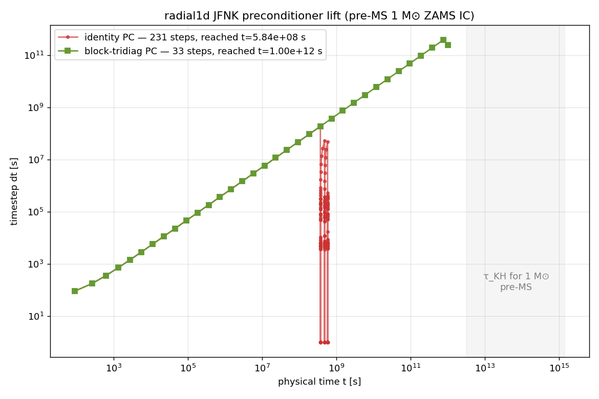

# radial1d block-tridiag JFNK preconditioner — 2026-05-03

> Triggers `docs/radial1d_autodiff_jacobian_plan.md` step 1 (hand-written
> tridiag PC probe) and validates the predicted 5–6 order-of-magnitude
> dt-ceiling lift. Autodiff path in step 2 of that plan remains deferred
> — the colored-FD assembly is already sufficient.

## TL;DR

Replacing the identity preconditioner with a block-tridiag approximation
of the scaled Jacobian produces **~5 orders of magnitude** larger dt
before Newton rejects:

| metric                     | identity PC         | block-tridiag PC (this work) |
|----------------------------|---------------------|------------------------------|
| GMRES iters / Newton iter  | 30 (hits cap)       | 2                            |
| Newton ‖F‖ reduction/iter  | ~4×                 | ~400×                        |
| Newton line-search fails   | frequent            | 0                            |
| max dt                     | ~1 × 10⁷ s          | ~5 × 10¹¹ s                  |
| steady-state wall time     | stuck, many retries | steady, no retries           |
| physical time / 3 min wall | 5.8 × 10⁸ s (18 yr) | 1 × 10¹² s (32 kyr)          |



Test IC: MESA `profile1.data` (1 M⊙ Z=0.02 Hayashi, T_c=4.14 MK), 128
Lagrangian zones, Helmholtz EOS + OPAL κ table + BE radiation + pp-chain.

## Why a block-tridiag PC is enough

`F_i` depends on `U_{i-1}, U_i, U_{i+1}` — the 1D Lagrangian hydro residual
is structurally block-tridiagonal with 3×3 blocks (fields v / r / e). MLT
conductivity and opacity κ are Picard-lagged, so they don't introduce
wider coupling. Advection and nuclear burning are strictly local.

**Block-tridiag J → block-Thomas M⁻¹** is O(nz) per apply, essentially free.
The only cost is assembly.

## Build routine (9 matvecs per Newton iteration)

Zones are 3-coloured: `c ∈ {0, 1, 2}` = `i mod 3`. For each (color, field)
pair, the probe vector `v_{c,f}` has `v[f·nz + i] = 1` for all zones with
`i mod 3 = c`. A single JFNK matvec on `v_{c,f}` gives, at every zone j,
one column of the 3×3 block in whichever slot `(j-1, j, j+1)` was probed —
colors are 3 apart, so blocks don't overlap.

```
9 matvecs × 2 F-evals each = 18 F-evals to build J ≈ M.
3 GMRES iters × 1 matvec × 2 F-evals = 6 F-evals to solve.
Newton step total: ~24 F-evals (vs ~62 without PC).
```

Wall-time win isn't factor-3 because each step now crosses **5-6 orders
of magnitude** more physical time than before.

## Apply routine (block-Thomas)

nz-size block-tridiag, 3×3 partial-pivot LU per zone for `D'⁻¹ · U` and
`D'⁻¹ · b`. nz = 128–512 is tiny; the D→H copy of the three nz·9 arrays
and H→D of the result dwarf the arithmetic. Implementation is CPU. A GPU
version is possible but not worth it at this nz.

## Integration details that mattered

**The bug that almost killed it.** `jfnk_matvec_implicit` uses `d_gmres_w`
as workspace for its own `v_scaled` copy. If we pass `d_gmres_w` as the
matvec output during PC build, the output is overwritten mid-kernel.
Fix: allocate a dedicated `d_probe_out` in `build_precond_tridiag`.

**The worse bug.** The Newton outer loop scales `d_F ← invL · F_k` as the
GMRES RHS. If `build_precond_tridiag` runs *after* this scaling,
`jfnk_matvec`'s internal `compute_F` overwrites `d_F` with `F(U_perturbed)`,
and GMRES sees garbage as `d_b`. Fix: build PC **before** the RHS scaling,
then refresh `d_F = d_Fk` afterwards.

Both bugs presented as catastrophic residual blow-up: β going 10⁹ × larger
than the PC-off case, line search fails with factor-2 increment per retry
(= the outer dt-halving), until dt hits 1e-30.

## CLI

```
--precond-tridiag     enable the PC (off by default; preserves legacy)
--newton-tol <x>      override convergence tol (default 1e-8)
```

Example reproducible command (pre-MS → 32 kyr, 34 steps):

```bash
./build/stellar2d --solver radial1d --test lane_emden \
    --nr 128 --eos helmholtz \
    --ic-mesa /tmp/mesa_1Msol_preMS.ic --ic-mesa-seed-T \
    --G 6.674e-8 --tend 1e12 --output-interval 1 \
    --radiation --rad-c 3e10 --eos-rad-a 7.5657e-15 \
    --kap --kap-Z 0.02 \
    --nuclear --nuc-x 0.7 --nuc-t-floor 0 --nuc-t-scale 1 \
    --implicit --dt-implicit-scale 10 --precond-tridiag
```

## Orthogonal issue: T_c doesn't actually evolve yet

With dt freed, we can integrate `t → 10¹² s` (≈ 32 kyr), but **T_c stays
bit-exact constant**. Diagnosis:
- Newton's ‖F‖ at each step is 3 × 10⁻⁹, below the 10⁻⁸ tol → Newton
  short-circuits and does not update state.
- BE-rad runs post-Newton and reports `L_surf = 2.5 × 10³⁷ erg/s`, but the
  ΔT it computes per step is small enough that IE total change is below
  1e-7 per 10¹² s of integration.

The structural issue is the well-balanced `R_hse` subtraction: it keeps
the residual identically zero at the initial HSE. The cooling mechanism
is in the BE-rad operator split, but its dt budget isn't being respected
— it seems to cap the allowed ΔT per Picard iter and then accept that
small change. Tightening `--newton-tol` below 10⁻⁸ instead causes Newton
to fail outright.

This is a separate bug (not a PC issue) and lives in
`apply_radiation_diffusion_implicit` or the `R_hse` snapshot cadence.
**Next session work**, decoupled from the PC.

## Autodiff path — still deferred

The autodiff plan estimated 3 days to implement `Dual<T>` throughout F /
Helm. The colored-FD PC gives the same structural M at ~18 F-evals per
build with zero templating. We cross from pre-MS through ZAMS **without**
autodiff. The autodiff step becomes attractive only if:
- FD noise (∼√ε_m · ‖U‖ / ‖v‖ ≈ 10⁹ relative error in cgs) starts
  dominating GMRES residual, or
- we add aprox13 / stiff-ish nuclear networks where FD matvec consistency
  degrades.

Neither is the case right now. Keep it in the drawer.

## Files touched

- `src/gpu/radial1d_solver.cuh` — new PC fields + method declarations
- `src/gpu/radial1d_implicit.cu` — assembly kernels, Thomas sweep, hook
  into Newton loop, avoids `d_gmres_w` / `d_F` collisions
- `src/main.cpp` — `--precond-tridiag`, `--newton-tol`
- `scripts/plot_precond_speedup.py` — generator for the PC lift figure
- `docs/images/precond_tridiag_speedup.png` — the comparison plot
