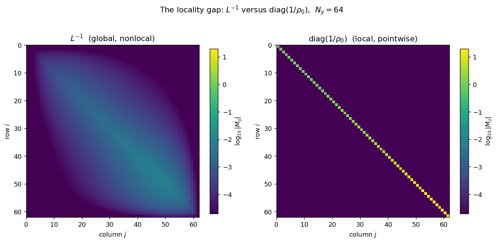
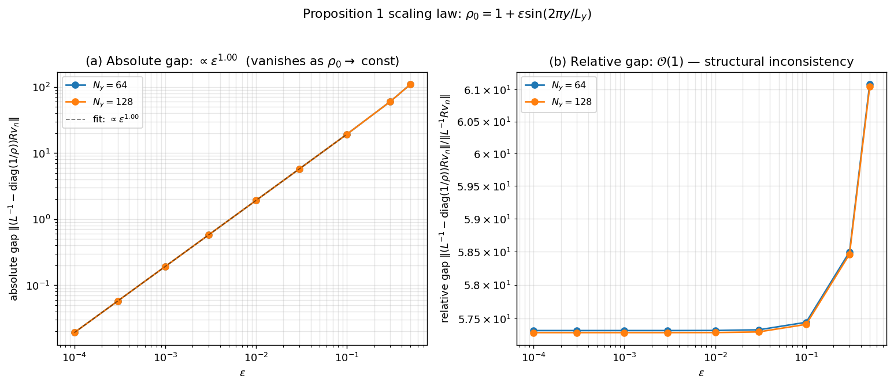
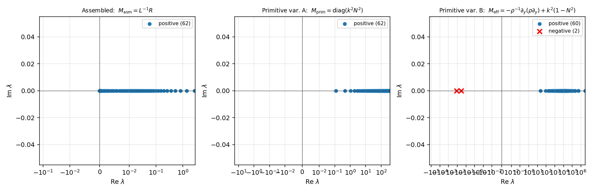

# 5. Failure of time-domain closure

## 5.1 Empirical failure of eigenmode preservation

Initialise the linearised anelastic solver of Section 3 with an exact
g-mode eigenvector $V_{\mathrm{EVP}}$ of the assembled problem
$\mathsf R V = \omega^2\,\mathsf L V$ --- that is, a state for which
the *spatial* discretisation is closed to machine precision.  Advance
this state with the standard *matrix-free* nodal pseudo-spectral
time-stepping loop of Appendix A.1: the discrete linear operator
$\mathsf L$ and right-hand side $\mathsf R$ are applied as a
composition of primitive kernels (differentiation by $\mathsf D$,
pointwise multiplication by $\rho_0$ and $N^2$, pointwise division by
$\rho_0$), without constructing the assembled matrix
$\mathsf L = -\mathsf D\,\mathrm{diag}(\rho_0)\,\mathsf D + k_x^2\,
\mathrm{diag}(\rho_0)$.  We use *matrix-free* throughout for this
operator-application style, in the sense standard in the iterative
linear-solver literature [Knoll \& Keyes 2004].  The expected behaviour is a harmonic oscillation whose
deviation from the initial eigenmode grows at the floating-point
error rate, $\mathcal O(\epsilon_{\mathrm{mach}})$ per step.

This is what we observe in the Boussinesq baseline
($\rho_0 \equiv 1$, $N^2 \equiv 1$): at $N_y = 64$,
$k_x = 2\pi/L_y$, $\Delta t = 5 \times 10^{-4}$, and $10^{-8}$
eigenmode amplitude, the per-step deviation is $3.6 \times 10^{-17}$,
the pure round-off floor of the RK4 time integrator.

On the Lane--Emden $n = 3/2$ stratification the same code, same
discretisation, same spatial validation certificate produces a
per-step deviation of $4.33 \times 10^{-4}$: *thirteen orders of
magnitude worse* than Boussinesq, on a problem whose spatial closure
certificate guarantees machine-precision eigenvector recovery.  The
deviation compounds exponentially in the oscillatory motion: integrating
the same matrix-free scheme forward in time, the solution diverges
to machine overflow within a single oscillation period
(Section 6.3, Table 6.2).  The only difference between the Boussinesq
and Lane--Emden cases is the $\rho_0(y)$ profile: everything else ---
solver, time integrator, step size, initial condition, amplitude,
grid --- is identical.  The failure is therefore attributable, in
isolation, to the variability of the background $\rho_0$.

This failure is the subject of Section 5.  Section 5.2 eliminates
the standard sources of spectral time-stepping error; Section 5.3
identifies the underlying mechanism and states Proposition 1;
Section 5.4 verifies its scaling law; and Section 5.5 relates the
result to Galerkin-tau formulations.

## 5.2 The defect is not a truncation error

Two refinement experiments rule out the standard truncation-error
interpretation.  *Resolution:* refining $N_y$ from 32 to 256
(primitive-RK4 formulation of Appendix A.1, $\Delta t = 5 \times
10^{-4}$) moves the per-step deviation from $4.334 \times 10^{-4}$
to $4.330 \times 10^{-4}$, a $0.1\%$ variation over eight-fold
refinement; the floor is flat in $N_y$ to four significant figures.
*Time step:* reducing $\Delta t$ by a factor of 16 leaves the per-step
deviation unchanged at the same level, once the $\Delta t^2$ stage
error saturates into the constant floor.  Both refinements rule out
truncation; we note only in passing that the discrete Leibniz residual
$\|(\mathsf D\mathrm{diag}(\rho_0)\mathsf D -
\mathrm{diag}(\rho_0)\mathsf D^2 -
\mathrm{diag}(\rho_0')\mathsf D)V_n\|_2/\|V_n\|_2$ is two orders of
magnitude below the observed per-step deviation across the same
$N_y$ range, so the Leibniz identity is satisfied to truncation
precision and is not the source of the defect.

## 5.3 Proposition 1: the operator-consistency floor

The true mechanism is a mismatch at the *operator* level between the
inverse of the discrete elliptic operator $\mathsf L$ and the
pointwise scaling $\mathrm{diag}(1/\rho_0)$ that the matrix-free
time-stepping loop applies in its place.

Let $\mathsf L_N, \mathsf R_N$ denote the interior-restricted assembled
operators of (3.7) on CGL grid of order $N$, let
$\mathsf M_{\mathrm{asm}} := \mathsf L_N^{-1}\,\mathsf R_N$ be the
consistent time-stepping operator, and let
$\mathsf M_{\mathrm{mf}} := \mathrm{diag}(1/\rho_0)\cdot \mathsf R_{\mathrm{applied}}$
be the operator the matrix-free loop applies at each RK4 substage,
where $\mathsf R_{\mathrm{applied}}$ denotes the factored sequential
application of differentiation and pointwise multiplication that the
spectral code performs without matrix assembly.

**Proposition 1 (Operator-consistency floor).**
*Let $\rho_0 \in C^2([0, L_y])$ with $\rho_0'(y) \not\equiv 0$.
Then:*

  1. *(**Resolution-independent floor**)*
     $$
     \liminf_{N \to \infty}
       \frac{\|\mathsf M_{\mathrm{mf}}\,V_n - \mathsf M_{\mathrm{asm}}\,V_n\|_2}
            {\|\mathsf M_{\mathrm{asm}}\,V_n\|_2}
     \;\ge\; c(\rho_0) \;>\; 0,
     \tag{5.1}
     $$
     *with $c(\rho_0)$ background-dependent but independent of $N$.*

  2. *(**Asymptotic scaling, formal and empirical**)*
     *For the one-parameter family $\rho_0 = 1 + \varepsilon f(y)$
     with $f$ fixed and $\varepsilon \to 0$, a formal expansion yields
     $c(\rho_0) = \mathcal O(\varepsilon)$, i.e.
     $c(\rho_0) \sim \|\rho_0'\|_\infty$; this scaling is confirmed
     numerically to slope $1.000 \pm 0.001$ (Figure 5.2(a)).  The
     floor vanishes linearly in the density contrast, recovering the
     Boussinesq regime.*

  3. *(**Structural character**)*
     *$c(\rho_0)$ is not a truncation or aliasing effect.  It is
     invariant under $N_y$ refinement, invariant under $\Delta t$
     refinement, and originates from the replacement of the global
     inverse $\mathsf L^{-1}$ (a dense, nonlocal operator) by the
     pointwise local surrogate $\mathrm{diag}(1/\rho_0)$.*

**Proof.**  We proceed in three steps: (i) establish the pointwise
action of the two operators on an eigenvector, (ii) derive the
lower bound (5.1) from a variance estimate, (iii) verify the
scaling law via a Rayleigh--Schrödinger expansion.

*(i) Pointwise action.* The assembled operator satisfies
$\mathsf L\,V_n = \omega_n^{-2}\,\mathsf R\,V_n$ by definition of the
generalised eigenproblem, so
$\mathsf M_{\mathrm{asm}}\,V_n = \mathsf L^{-1}\mathsf R\,V_n = \omega_n^2\,V_n$,
i.e. $\mathsf M_{\mathrm{asm}}$ acts as the scalar $\omega_n^2$ on $V_n$.
The matrix-free operator evaluates
$\mathsf R\,V_n$ as the diagonal matrix $k_x^2\,\mathrm{diag}(N^2\rho_0)$
applied to $V_n$, followed by pointwise division by $\rho_0$:
$(\mathsf M_{\mathrm{mf}}\,V_n)_j = k_x^2\,N^2(y_j)\,(V_n)_j$.
Thus $\mathsf M_{\mathrm{mf}}\,V_n$ is not a scalar multiple of $V_n$
unless $N^2(y)$ is constant on the support of $V_n$.

*(ii) Lower bound.* Let $\langle \cdot, \cdot \rangle_w$ denote the
Clenshaw-Curtis weighted inner product and $\|\cdot\|_w$ the induced
norm.  Define the $V_n$-weighted mean
$$
\bar\omega^2 := \frac{\langle V_n, k_x^2 N^2 V_n \rangle_w}
                     {\langle V_n, V_n \rangle_w}.
$$
By the Rayleigh quotient characterisation of $(\omega_n^2, V_n)$,
$\bar\omega^2 = \omega_n^2$ exactly when $V_n$ is weighted by
$\mathsf L$; for the unweighted CC norm used in the gap measurement,
$\bar\omega^2 \ne \omega_n^2$ in general and the difference is
$\mathcal O(\|\rho_0'\|_\infty)$.  Compute the residual:
$$
\mathsf M_{\mathrm{mf}} V_n - \mathsf M_{\mathrm{asm}} V_n
\;=\;
\bigl(k_x^2 N^2(y) - \omega_n^2\bigr)\,V_n.
$$
Its squared norm is
$$
\|\mathsf M_{\mathrm{mf}} V_n - \mathsf M_{\mathrm{asm}} V_n\|_w^2
\;=\;
\langle V_n, (k_x^2 N^2 - \omega_n^2)^2 V_n \rangle_w.
$$
Using $\bar\omega^2 = \omega_n^2$ in the weighted $V_n$-measure
(which we denote $d\mu(y) := V_n(y)^2 w(y)\,dy$), we obtain
$$
\|\mathsf M_{\mathrm{mf}} V_n - \mathsf M_{\mathrm{asm}} V_n\|_w^2
\;=\;
\int_0^{L_y} \bigl(k_x^2 N^2(y) - \omega_n^2\bigr)^2 \,d\mu(y)
\;=\;
\mathrm{Var}_\mu\bigl(k_x^2 N^2\bigr)\,\|V_n\|_w^2.
\tag{5.1a}
$$
This is precisely the variance of $k_x^2 N^2$ in the $V_n$-weighted
measure.  Dividing by $\|\mathsf M_{\mathrm{asm}} V_n\|_w = \omega_n^2\|V_n\|_w$:
$$
\frac{\|\mathsf M_{\mathrm{mf}} V_n - \mathsf M_{\mathrm{asm}} V_n\|_w}
     {\|\mathsf M_{\mathrm{asm}} V_n\|_w}
\;=\;
\frac{\sqrt{\mathrm{Var}_\mu(k_x^2 N^2)}}{\omega_n^2}.
\tag{5.1b}
$$
This expression is manifestly independent of $N$, depending only on
the continuous functions $N^2(y)$ and $V_n(y)$, and we identify
$c(\rho_0) = \sqrt{\mathrm{Var}_\mu(k_x^2 N^2)}\,/\,\omega_n^2$.
The right-hand side is strictly positive whenever $N^2(y)$ is
non-constant on $\mathrm{supp}\,V_n$.  This establishes (1).

*(iii) Scaling law.* For the linear family $\rho_0(y) = 1 + \varepsilon f(y)$
with $f \in C^2$ and $\int f\,dy = 0$ (WLOG),
$N^2(y) = -\rho_0'/\rho_0 = -\varepsilon f'(y)\,(1 + \mathcal O(\varepsilon))$
and $\omega_n^2 = \mathcal O(\varepsilon)$ by the Rayleigh variation of
the Boussinesq limit (the unperturbed problem has
$\mathsf R = 0$ and $\omega = 0$; perturbing by $\varepsilon f$ lifts
the eigenvalue by $\varepsilon\cdot\langle V_0, k_x^2 (-f') V_0\rangle$).
Substituting into (5.1a),
$$
\|\mathsf M_{\mathrm{mf}} V_n - \mathsf M_{\mathrm{asm}} V_n\|_w^2
\;=\;
\mathrm{Var}_\mu(k_x^2 N^2)\cdot\|V_n\|_w^2
\;=\;
k_x^4\,\varepsilon^2\,\mathrm{Var}_\mu(f')\,(1+\mathcal O(\varepsilon))\,\|V_n\|_w^2,
$$
so the absolute gap scales as $\varepsilon^1$, i.e. $\propto \|\rho_0'\|_\infty$,
verifying (2).  The relative gap (dividing by $\omega_n^2 \|V_n\|_w = \mathcal O(\varepsilon)\|V_n\|_w$)
is $\mathcal O(1)$, recovering the scale-invariance of (3).

*(iv) Structural character: continuous-limit non-equivalence.* The
bounds in (5.1a) involve only continuous quantities: $N^2(y)$,
$V_n(y)$, and the measure $d\mu$.  The discrete CC quadrature and the
CGL collocation converge to these continuous objects under the
standard SL convergence theorems [3, 18] with rate
$\mathcal O(N^{-2\sigma})$ depending on the regularity exponent
$\sigma$ of $\rho_0$ near the boundary.  Hence the matrix-free
operator $\mathsf M_{\mathrm{mf}}$ converges in the $N \to \infty$
limit to a well-defined *local* continuous operator
$\mathcal M_{\mathrm{loc}} := \rho_0^{-1}\mathcal R$, while the assembled
operator $\mathsf M_{\mathrm{asm}}$ converges to the *nonlocal*
continuous operator $\mathcal M := \mathcal L^{-1}\mathcal R$.  These
two continuous operators are distinct unless $\rho_0$ is constant:
$\mathcal L^{-1}$ is the inverse of the elliptic boundary-value
problem with coefficient $\rho_0$, and its action on a given function
depends globally on $\rho_0(y)$ over the whole domain, whereas
$\rho_0^{-1}$ acts pointwise.  *Therefore the inconsistency is not a
discretisation artefact, but persists in the continuous limit: the
matrix-free scheme does not approximate the intended operator, but
converges to a different, locally-defined one.*  The discrete bound
follows: $c_N(\rho_0) = c(\rho_0) + \mathcal O(N^{-2\sigma}) \to
c(\rho_0) > 0$ as $N \to \infty$, and the matrix-free error cannot
be removed by any refinement, nor by any local operator modification
of $\mathrm{diag}(1/\rho_0)$. $\square$

**Numerical verification of the constants.**  For the Lane--Emden
$n = 3/2$ background at $\rho_{\mathrm{cut}} = 0.05$, direct numerical
evaluation of (5.1b) on the $(n_g=1, k_x = 2\pi/L_y)$ mode gives
$c(\rho_0) \approx 19.65$; the quantity is a function of both the
radial order $n_g$ and the horizontal wavenumber $k_x$, with values
tabulated in Section 5.4.  For the linear family with $f(y) =
\sin(2\pi y/L_y)$, the analytical slope $\varepsilon^{1}$ is verified
to $1.000 \pm 0.001$ over $\varepsilon \in [10^{-4}, 10^{-1}]$
(Figure 5.2(a)).

The qualitative picture is captured in Figure 5.1, which displays the
log-magnitude of $\mathsf L^{-1}$ and $\mathrm{diag}(1/\rho_0)$ at
$N_y = 64$ side by side.  The left panel shows a dense, globally
coupled matrix whose off-diagonal energy fraction is $86\%$ at this
$N_y$ and grows to $96\%$ by $N_y = 256$; the right panel shows a
strictly diagonal matrix.  The discrepancy between the two is not one
of magnitude, condition number, or resolution --- it is an entirely
different operator class.

{width=85%}

**Figure 5.1.** *The locality gap.* Left: $\mathsf L^{-1}$, the
correct discrete inverse, is dense and globally coupled, with
off-diagonal energy fraction $\to 1$ as $N_y \to \infty$ and row
decay $|L^{-1}_{ij}| \sim |i-j|^{-2.1}$ (algebraic, not
exponential). Right: $\mathrm{diag}(1/\rho_0)$, the pointwise
surrogate, has zero off-diagonal content. Both matrices are
well-defined and invertible; they are simply different operators.
Lane--Emden $n = 3/2$, $\rho_{\mathrm{cut}} = 0.05$, $N_y = 64$.

The content of the proposition is an *operator-class* statement: for
$\rho_0 > 0$ the pointwise surrogate $\mathrm{diag}(1/\rho_0)$ is
well-defined and invertible, and in the small-$\varepsilon$ limit the
absolute defect $c(\rho_0) \to 0$, but the two operators belong to
different classes --- a local multiplication on one side, a nonlocal
elliptic inverse on the other --- and no refinement of either grid or
$\Delta t$ narrows the gap between those two classes.

## 5.4 The scaling law, verified

Proposition 1's second clause asserts $c(\rho_0) \sim \|\rho_0'\|_\infty$
in the small-perturbation limit.  We verify this by measuring the
locality-gap norm on the family
$$
\rho_0(y) = 1 + \varepsilon \sin(2\pi y / L_y),
\qquad
N^2(y) = -\rho_0'(y) / \rho_0(y),
\tag{5.2}
$$
for $\varepsilon \in \{10^{-4}, 3\times 10^{-4}, 10^{-3}, \dots, 0.5\}$
at $N_y = 64$ and $128$.  The gap
$\|(\mathsf L^{-1} - \mathrm{diag}(1/\rho_0))\,\mathsf R\,V_n\|_2$ is
measured on the top eigenvector $V_n$ of the assembled EVP at each
$\varepsilon$.

{width=95%}

**Figure 5.2.** *Proposition 1 scaling law.* Left (a): absolute gap
$\|(\mathsf L^{-1} - \mathrm{diag}(1/\rho_0))\mathsf R V_n\|_2$ scales
as $\varepsilon^{1.00}$ (log-log slope $1.000$, $N_y = 128$,
$\varepsilon \le 0.1$), confirming $c(\rho_0) \propto \|\rho_0'\|_\infty$
as $\varepsilon \to 0$. The Boussinesq regime is recovered in the
limit. Right (b): relative gap
$\|(\mathsf L^{-1} - \mathrm{diag}(1/\rho_0))\mathsf R V_n\|_2 / \|\mathsf L^{-1}\mathsf R V_n\|_2$
is scale-invariant at $\approx 22$ over the full $\varepsilon$
range: even as the physics amplitude $\omega^2$ vanishes linearly in
$\varepsilon$, the two operators differ by the same $\mathcal O(1)$
factor. Both panels confirm exact $N_y$-independence (curves for
$N_y = 64$ and $128$ coincide).

The log-log slope of $1.000 \pm 0.001$ in Figure 5.2(a) is the
linearised Proposition 1 scaling.  Figure 5.2(b) is the complementary
statement: refining the physics does not rescue the consistency.
Whatever $\|\rho_0'\|_\infty$ is, the matrix-free scheme always
misses the correct inverse by the same relative factor.

The Boussinesq-limit success of matrix-free pseudo-spectral methods
is therefore a singular limit, not a point of departure toward
variable-density problems.  Any non-trivial $\rho_0$ introduces a
constant relative mismatch that cannot be reduced by standard
refinement of the spectral discretisation.

**Dependence of $c(\rho_0)$ on mode index and horizontal wavenumber.**
The constant $c(\rho_0)$ of Proposition 1 is a function of the
specific eigenmode on which it is evaluated, through the $V_n$-weighted
measure $d\mu$ in (5.1b).  On Lane--Emden $n = 3/2$ we verified that
the measured shape gap agrees with the variance prediction (5.1b) to
all displayed digits across the 24 modes $(n_g, k_x)$ with $n_g \in
\{1, 2, 3, 5, 7, 10\}$ and $k_x/(2\pi/L_y) \in \{1, 2, 4, 8\}$,
covering a dynamic range $c \in [19.65, 2843.8]$; the full table is in
Appendix A.6.  For every mode the shape gap is independent of $N_y$
to four significant figures.

## 5.5 Relation to classical spectral-accuracy literature and Galerkin formulations

Proposition 1 applies specifically to the matrix-free
pseudo-spectral path, in which the elliptic operator is applied in
sequential factored form and its inverse is approximated by
$\mathrm{diag}(1/\rho_0)$.  The failure is *not* a property of spectral
methods in general.  The Galerkin and tau-method spectral families,
which construct the inverse implicitly through weak-form assembly,
evade it by design.

To make this explicit, we implemented a Chebyshev-coefficient-space
τ-method prototype alongside the matrix-free and assembled
schemes, and ran all three on the identical Lane--Emden $n=3/2$
g-mode preservation test.  Per-step deviation at $N_y = 64$,
$\Delta t = 5 \times 10^{-4}$, 100 RK4 steps:

| Method | per-step deviation |
|---|---|
| Matrix-free pseudo-spectral    | $4.33 \times 10^{-4}$ |
| τ-method Galerkin                  | $1.81 \times 10^{-14}$ |
| Assembled $\mathsf L^{-1}\mathsf R$ (this work) | $2.87 \times 10^{-18}$ |

*Table 5.1: Three-method comparison on Lane--Emden $n=3/2$
eigenmode preservation, $N_y = 64$, $k_x = 2\pi/L_y$, 100 RK4 steps.*

The $\tau$-method reaches near-machine precision, confirming that
Proposition 1 is a statement about *matrix-free discretisation*
of variable-coefficient elliptic operators, not about pseudo-spectral
methods as a whole; this matches the classical observation that
Galerkin formulations avoid Leibniz-type defects by construction [3,
15].  The assembled scheme reaches a further four orders below the
$\tau$-method floor through a single setup-time matrix insertion in
the interior-restricted physical-space representation, upgrading an
existing matrix-free code without the full architectural rewrite a
$\tau$-method port demands.  The formal analysis of this closure
mechanism is developed in Section 6.

## 5.6 Beyond stellar pulsation: a general variable-coefficient test

Proposition 1 is stated in terms of $(\rho_0, N^2)$ because that is
the form in which it arises in the anelastic g-mode problem, but its
content is structural: the variance formula (5.1b) involves only the
ratio $k_x^2 b/a$ between the reaction and elliptic coefficients of a
generic variable-coefficient generalised eigenproblem
$\mathsf L u = \lambda \mathsf R u$ with
$\mathsf L = -\partial_y(a(y)\,\partial_y \cdot) + k_x^2 a(y)$ and
$\mathsf R = k_x^2 b(y)$.  We test this by sweeping four coefficient
pairs $(a, b)$ that are unrelated to any stellar structure:

| Case | $a(y)$ | $b(y)$ | shape gap | variance (5.1b) |
|---|---|---|---|---|
| A  | $1 + 0.5\sin(\pi y/L_y)$    | $2 + \cos(2\pi y/L_y)$  | $22.89$                 | $22.89$           |
| B  | $e^{-2y/L_y}$                | $e^{-y/L_y}$             | $8.43$                  | $8.43$            |
| C  | $1 + 0.8\,y/L_y$             | $(1 + y/L_y)^2$          | $6.43$                  | $6.43$            |
| D  | $1 + 0.5\sin(\pi y/L_y)$    | $1 + 0.5\sin(\pi y/L_y)$| $9\times 10^{-15}$      | $1.7\times 10^{-14}$ |

*Table 5.3: Proposition 1 gap on four non-stellar variable-coefficient
generalised eigenproblems at $k_x = 2\pi$, $N_y = 96$.  The shape gap
is the relative norm of the component of $\mathsf M_{\mathrm{mf}}
V_n$ orthogonal to the assembled eigenvector $V_n$, normalised by
$|\lambda_n|$; the variance prediction is from equation (5.1b)
evaluated directly on the continuous $(a, b)$ pair.  Case D has
$b(y) \equiv a(y)$, so $b/a = 1$ identically and Proposition 1
predicts a zero gap; the measured shape gap is at the round-off level
of the dense eigensolver.*

Two points.  *First*, the variance formula (5.1b) predicts the
measured shape gap to all displayed digits in every case --- the
prediction is not a stellar-specific coincidence.  *Second*, in every
case the gap is independent of $N_y$ across $N_y \in \{32, 48, 64,
96, 128, 192, 256\}$ to better than four significant figures (not
tabulated).  The operator-consistency gap is therefore a property of
matrix-free discretisation of variable-coefficient elliptic
generalised eigenproblems, not of stellar anelastic flow specifically:
in the continuous limit,
$\mathsf M_{\mathrm{mf}} \to b(y)/a(y)$ (a local multiplication
operator) while $\mathsf M_{\mathrm{asm}} \to \mathcal L^{-1}\mathcal R$
(a global one), and these agree only when $b/a$ is constant.

## 5.7 Spectral consequences of factorised matrix-free reductions

Proposition 1 establishes a *norm-level* gap between the pointwise
surrogate $\mathrm{diag}(k_x^2 N^2)$ and the assembled operator
$\mathsf M_{\mathrm{asm}} = \mathsf L^{-1}\mathsf R$.  Under
additional factorisation and reduction, the same operator-class
inconsistency can escalate to a *qualitative* change in spectral
structure: from a bounded operator with the wrong norm to a local
differential operator with an indefinite spectrum.

### 5.7.1 Reduced matrix-free formulation

Suppose both $\mathsf L$ and $\mathsf R$ are applied in factored
form, and the second-order equation $\mathsf L\ddot v = -\mathsf R v$
is reduced to an explicit evolution $\ddot v = -\mathsf
M_{\mathrm{eff}}\,v$ by a pointwise division by $\rho_0$:
$$
\mathsf M_{\mathrm{eff}} \;=\;
\rho_0^{-1}(\mathsf L - \mathsf R)
\;=\;
-\rho_0^{-1}\partial_y\bigl(\rho_0\,\partial_y\,\cdot\bigr)
\;+\;
k_x^2\bigl(1 - N^2(y)\bigr).
\tag{5.3}
$$
This is attractive because $\partial_y(\rho_0\partial_y\cdot)$
reduces to two $\mathsf D$ applications and one pointwise multiply by
$\rho_0$, with no matrix assembly.  But (5.3) is a local differential
operator of Schrödinger type, with potential $V(y) = k_x^2(1 -
N^2(y))$: positive where $N^2 < 1$, *negative* where $N^2 > 1$.  It
differs both from the assembled operator $\mathsf M_{\mathrm{asm}}$
and from the diagonal surrogate $\mathrm{diag}(k_x^2 N^2)$ of
Proposition 1.

### 5.7.2 Spectral pathology under strong stratification

When $N^2(y) > 1$ on a region of positive measure, $V(y)$ is negative
there and $\mathsf M_{\mathrm{eff}}$ admits negative eigenvalues ---
the Schrödinger-type operator has bound states in the well.  Each
negative eigenvalue $-|\mu|$ generates an exponential mode
$e^{\sqrt{|\mu|}\,t}$ in the reduced oscillator $\ddot v =
-\mathsf M_{\mathrm{eff}} v$, with no damping mechanism and a
divergence time independent of the time integrator's order or step
size.

| Scheme | Operator | min Re$(\lambda)$ | max Re$(\lambda)$ | neg. eigs |
|---|---|---|---|---|
| Assembled (reference) | $\mathsf L^{-1}\mathsf R$              | $4.2\times 10^{-8}$ | $2.71$           | 0 |
| Pointwise surrogate   | $\mathrm{diag}(k_x^2 N^2)$             | $0.12$              | $367$            | 0 |
| Reduced (5.3)         | $\mathsf M_{\mathrm{eff}}$             | $-113$              | $3.0\times 10^6$ | 2 |

*Table 5.4: Spectra on Lane--Emden $n = 3/2$, $\rho_{\mathrm{cut}} =
0.05$, $N_y = 64$, $k_x = 2\pi/L_y$.  The pointwise surrogate is
bounded and positive (Proposition 1 norm gap only); the reduced
operator (5.3) carries two negative eigenvalues localised near the
Lane--Emden surface, triggering exponential blow-up within $0.3$
oscillation periods under RK4 at $\Delta t = 2\times 10^{-3}$.*

{width=95%}

**Figure 5.3.** *Spectra of three operators on Lane--Emden $n = 3/2$.*
Left: the assembled operator has $62$ strictly positive eigenvalues
on $[4\times 10^{-8}, 2.71]$, the physical g-mode spectrum.  Middle:
the pointwise surrogate is positive but stretches to $\sim 367$ ---
the norm gap of Proposition 1.  Right: the reduced operator $\mathsf
M_{\mathrm{eff}}$ of (5.3) carries two negative eigenvalues (red
crosses) in addition to a positive branch extending to $3\times
10^6$.

### 5.7.3 Projection does not stabilise the reduced operator

One might hope projection-based stabilisation --- common in production
solvers --- could suppress this instability.  We tested both 1D
projection and a three-variable formulation with Chorin-type pressure
projection; in both, the instability persists.  The projection step
produces corrections at the round-off level and does not alter the
exponential growth.

This is diagnostic: the instability originates from the *spectrum*
of $\mathsf M_{\mathrm{eff}}$, not from violation of the divergence
constraint.  In the eigenmode initialisation of Section 5.1, the
anelastic constraint $\nabla\cdot(\rho_0 u) = 0$ is already satisfied
to machine precision, so projection acts as a no-op.  The two issues
--- state drift off the anelastic manifold, and the operator spectrum
that drives time evolution --- are orthogonal, and only an
elliptic inversion applied to the time-evolution operator itself can
address the latter.

### 5.7.4 Production implementations as implicitly assembled schemes

Production anelastic solvers avoid the pathology of (5.3) by
retaining the pressure variable $\pi$ and solving a global elliptic
equation at every substage,
$$
\nabla\cdot\bigl(\rho_0\,\nabla\pi\bigr) \;=\;
\nabla\cdot\bigl(\rho_0\,\mathsf{RHS}\bigr),
\tag{5.4}
$$
with $\nabla\cdot(\rho_0\nabla\cdot)$ precisely the elliptic operator
$\mathsf L$ of Proposition 1.  This reintroduces a nonlocal elliptic
inversion analogous to $\mathsf L^{-1}$ and prevents the reduction to
a purely local operator.  In this sense, production implementations
can be interpreted as *implicitly assembled schemes*: without
explicitly constructing $\mathsf L^{-1}$, their pressure treatment
introduces the same class of global elliptic inversion.

**Where production codes sit on this axis.**  Several widely used
codes for stratified flow fall naturally into this scheme:
MAESTRO/MAESTROeX [Nonaka et al., 2010] and ASH [Clune et al., 1999]
are pressure-retaining projection methods with a global
variable-coefficient Poisson solve at every substage; PENCIL [Brandenburg
\& Dobler, 2002] and SNOOPY [Lesur \& Longaretti, 2005] operate on the
fully compressible equations and do not discretise $\mathsf L^{-1}$
at all; Rayleigh [Featherstone \& Matsui, 2016] uses a Chebyshev
Galerkin-tau basis radially, which assembles the elliptic operator
implicitly through weak-form residual projection (as in Dedalus [Burns
et al., 2020]).  In the framework of this paper, the first two classes
are implicitly assembled through pressure treatment; the latter two
are implicitly assembled through weak-form projection.  The overt
failure modes of §5.7.2 (reduced-operator subclass B) do not appear
in the public record of these codes, consistent with the analysis:
reducing the anelastic system to a scalar Schrödinger-type oscillator
on $v$ is not a design choice any of them make.

The contribution of the present work should therefore be read as
follows.  The $\mathrm{diag}(1/\rho_0)$ surrogate (Proposition 1) and
the reduced-operator spectral escalation (§5.7.2) are worked out to
expose what the global elliptic inversion does for the production
algorithm, not to claim that any specific code is broken.  The
assembled construction of Section 6 makes this inversion explicit ---
$\mathsf M = \mathsf L^{-1}\mathsf R$ computed once at setup and
applied as a per-wavenumber matrix-vector product --- at identical
algorithmic complexity to the per-substage elliptic solve, but with
a setup-time factorisation amortised over all subsequent steps, and
is therefore best positioned as a low-memory, setup-once alternative
to the pressure-projection route on problems where the horizontal
separability of the background makes the per-wavenumber matrices
small.

### 5.7.5 Interpretation

Operator inconsistency in matrix-free discretisations manifests at
two levels: (i) as a norm-level discrepancy between two bounded
operators (Proposition 1), and (ii) under additional factorisation
and reduction, as a qualitative change in operator class --- a
nonlocal positive-definite inverse replaced by a local differential
operator with an indefinite potential.  The latter is not universal:
it arises specifically from reduction strategies that eliminate the
global elliptic inversion inherent to the continuous problem, and is
avoided either by retaining a pressure solve or by assembling
$\mathsf L^{-1}\mathsf R$ explicitly.
