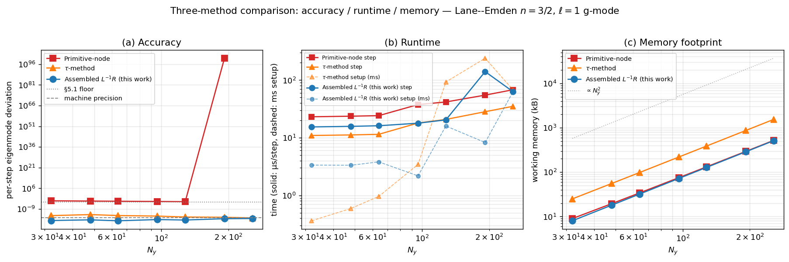

# 8. Discussion

## 8.1 Scope and limits

The framework developed in Sections 2--7 targets two-dimensional
anelastic flow in a horizontally periodic, radially wall-bounded
domain with a time-independent radial stratification.  The
Liouville-SL machinery (Section 3) requires only hydrostatic
smoothness for the SL eigenvalue problem to be well-posed; the
assembled-operator closure (Section 6) is independent of the
stratification profile, requiring only that the linearised anelastic
system reduces to a second-order ODE in time.  The Strang-split
nonlinear extension (Section 7) inherits the linear closure and
adds $\mathcal O(\Delta t^4)$ splitting error.

The framework does *not* address fully compressible acoustic
physics (anelastic filters out p-modes by construction), non-radial
stratification (the horizontal Fourier transform no longer
diagonalises the elliptic operator), or rotation and magnetism (the
variable set enlarges but the operator-consistency argument is
unchanged).  These are separable extensions, each requiring
additional per-wavenumber operators but not altering Proposition 2 or
Proposition 1 in any essential way.

**Scalability to non-separable backgrounds.** The
$\mathcal O(n_h \cdot N_y^2)$ memory footprint and $\mathcal O(N_y^2)$
per-substep cost of the assembled scheme both rest on the assumption
that the background $(\rho_0(y), N^2(y))$ depends only on the
radial coordinate, so that the horizontal Fourier decomposition
block-diagonalises the elliptic operator and each
$\mathsf L_{k_x}$ acts on an $N_y$-vector rather than a full 2D
state.  If $\rho_0$ or $N^2$ acquires horizontal structure ---
through rotation-induced baroclinicity, global-scale circulation,
ellipticity, or a 3D stellar interior --- the assembled matrix
becomes $(N_x N_y) \times (N_x N_y)$ and the favourable cost
envelope vanishes: the efficiency advantage relative to iterative
(multigrid, Krylov) approaches is specific to the separable case.
Proposition 1 continues to hold in the non-separable setting --- the
matrix-free scheme still replaces a global elliptic inverse with
a pointwise surrogate --- but the argument for assembled
$\mathsf L^{-1}\mathsf R$ over iterative alternatives rests on the
block structure and does not extend automatically.  A 3D
non-separable generalisation is outside the scope of the present
work.

## 8.2 Relation to GYRE

GYRE is the de facto reference for adiabatic non-rotating stellar
pulsation; it operates in one dimension on a pre-computed stellar
structure and returns eigenpairs $(\omega^2, \xi)$ for given
$(\ell, n_g)$.  Our Section 4 benchmark uses GYRE to validate the
spatial machinery; our framework reproduces GYRE eigenvalues to
$9.1\times 10^{-9}$ at $N_r = 96$ (Table 4.1), a floor set by
LAPACK round-off rather than discretisation.

A natural delineation of scope is that GYRE computes the linear
spectrum used for initial conditions, and the present framework
evolves those
conditions forward under nonlinear physics.  For the linear regime,
the two codes agree to machine precision (modulo eigensolver
round-off); for finite amplitudes, our framework provides
information that GYRE cannot --- mode coupling, energy cascades,
nonlinear saturation.

## 8.3 Relation to Dedalus and to the Galerkin spectral family

Dedalus [2] implements the tau-method Galerkin path, constructing the
elliptic operator in Chebyshev-coefficient space with tau-row
boundary-condition insertion.  This weak-form route never factors the
inverse into primitive pieces and therefore never builds the pointwise
surrogate of Proposition 1; the operator-consistency failure of
Section 5 does not arise by construction.  Section 5.5 gives the
direct three-method comparison.  Figure 8.1 extends this comparison
to $N_y \in \{32, \dots, 256\}$, showing that the assembled scheme
reaches its $10^{-18}$ per-step deviation at roughly one-third the
$\tau$-method's working-memory footprint and within a factor of two of
either method's per-substep runtime --- positioning assembled
$\mathsf L^{-1}\mathsf R$ as an additional low-memory route to the
closure already available through the $\tau$-method, obtainable by
a single setup-time matrix insertion into an existing matrix-free
pipeline rather than the full architectural rewrite a $\tau$-method
port would demand.

{width=95%}

**Figure 8.1.** *Three-method comparison on Lane--Emden $n = 3/2$
g-mode preservation across $N_y \in \{32, \dots, 256\}$.* Panel (a):
per-step eigenmode deviation. Panel (b): per-step and setup runtime.
Panel (c): working memory. The assembled scheme (blue circles)
reaches $10^{-18}$ per-step deviation at roughly one-third the
working-memory footprint of the $\tau$-method (orange triangles,
$10^{-14}$ floor), and within a factor of two of either method's
per-substep runtime.  The matrix-free scheme (red squares) sits at
the $\sim 10^{-4}$ Proposition 1 floor and is flat in $N_y$ across
the whole sweep, as expected from the resolution-independent bound
(5.1b).

## 8.4 The underlying principle

The findings of Sections 5 and 6 can be stated compactly: *spectral
accuracy of the basis does not imply operator consistency of the
time-stepping loop.  The distinction is that between approximation
and closure; basis refinement improves approximation, but only an
assembled operator closes the discrete evolution.*

The Leibniz defect of the pseudo-spectral literature [15] --- a
truncation-level residual of order $N^{-r}$ --- is *not* the
mechanism here.  The mechanism is a structural mismatch between a
global elliptic inverse and a pointwise scaling, which persists
under any refinement of either $N_y$ or $\Delta t$, and which is
independent of the boundary conditions and the state variable
chosen.  Proposition 1 makes this precise and quantifies it with a
scaling law in the density-contrast parameter.

Galerkin formulations avoid the issue by *not building the pointwise
surrogate in the first place*.  Matrix-free pseudo-spectral
codes, which are the standard on GPU for reasons of memory layout
and kernel simplicity, inherit the surrogate by construction.  The
remedy is not to abandon the matrix-free architecture --- that is
expensive and disruptive --- but to insert one setup-time operator
assembly, restoring consistency without architectural change.

## 8.5 Open questions

1. *Three-dimensional extension.*  A full 3D spherical-harmonic
   anelastic DNS requires $\mathcal O(\ell_{\max}^2)$ assembled
   matrices (one per harmonic) versus our $\mathcal O(n_h)$
   per-wavenumber matrices; memory scales by $\ell_{\max}$, which
   at $\ell_{\max} = 64$ is still manageable.  Proposition 1 applies
   unchanged.

2. *Non-separable elliptic systems.*  If $\rho_0$ or $N^2$ depends on
   horizontal coordinate, the Fourier decomposition no longer
   diagonalises the elliptic operator, and the assembled matrix
   becomes full $(N_x N_y) \times (N_x N_y)$ rather than block
   diagonal in $k_x$.  Iterative methods (multigrid, Krylov) are
   the standard response; Proposition 1 extends to this setting
   but the closure requires a global inverse, which cannot be
   approximated by any separable surrogate without reintroducing a
   locality-gap failure.

3. *Non-adiabatic pulsation.*  Extending the framework to include a
   phenomenological heat-diffusion term in the buoyancy equation is
   straightforward and matches one of GYRE's standard operating
   regimes.

4. *The general principle in other contexts.*  Proposition 1
   concerns the specific case $\mathsf L = -\mathsf D\mathrm{diag}(\rho_0)\mathsf D + k_x^2\mathrm{diag}(\rho_0)$.
   The same *locality gap* between a global elliptic inverse and its
   pointwise surrogate should affect any pseudo-spectral DNS of a
   variable-coefficient elliptic problem in matrix-free form ---
   for example, inhomogeneous MHD, convective boundary layers with
   non-uniform diffusivity, or pseudo-spectral ocean models with
   bathymetric variation.  Whether the per-step defect in those
   settings is practically significant is context-dependent, but the
   structural mechanism is the same.
